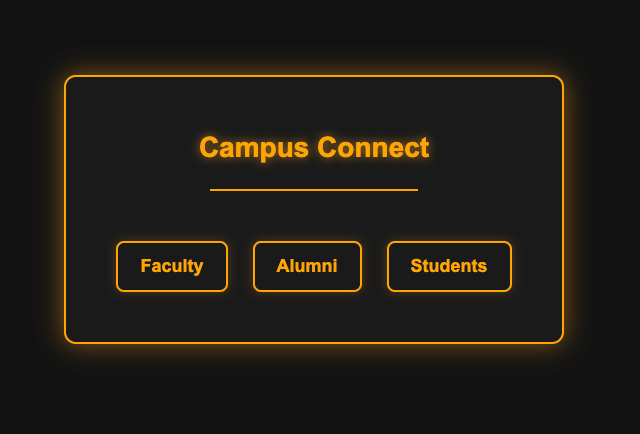
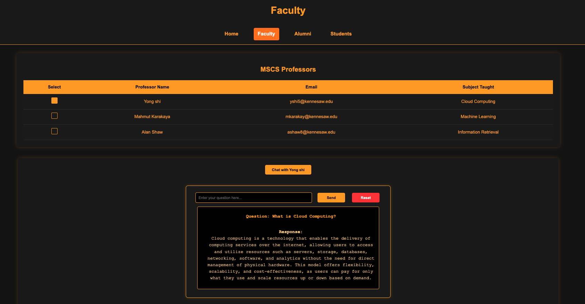

# CS_ConnectHub
An AI-powered web platform built with Flask and OpenAI API that connects students, faculty, and alumni through an intelligent chatbot interface for quick access to academic and networking information.


## Table of contents
- [Overview](#overview)
- [User Story](#user-story)
- [Acceptance Criteria](#acceptance-criteria)
- [Features](#features)
- [Tech Stack](#tech-stack)
- [Project Visuals](#project-visuals)
- [Installation](#installation)
- [Running the Application](#running-the-application)
- [Run on a custom port](#run-on-a-custom-port)
- [Deployment](#deployment)
- [Project Structure](#project-structure)
- [Tech Stack](#tech-stack)
- [Tools Used ](#tools-used )
- [References](#references)

---

## Overview
**CS_ConnectHub** is a Flask-based web application that enables students, faculty, and alumni to interact through an AI-powered chatbot interface.  
It allows users to retrieve relevant academic and professional information by selecting a category and engaging in a conversational experience.

**Personas:**
- **Student:** Needs academic guidance, course info, or networking opportunities.
- **Faculty:** Shares expertise, academic guidance, and career advice.
- **Alumni:** Offers mentorship, job insights, and industry connections.
---
##  User Story
> Create a mscs application that allows the student to interact and retrive information from Faculty, Alumini and Student, on selection using chatbot.
---
##  Acceptance Criteria
- Ability to choose between **Faculty**, **Alumni**, or **Student** chat modes.
- AI-generated responses relevant to the selected persona.
- Responsive and accessible UI design.
- Secure storage of API keys.

---
##  Features
- AI chatbot integration using **OpenAI API**
- Role-based interaction: **Students**, **Faculty**, and **Alumni**
- Clean, responsive UI built with **HTML, CSS, and Bootstrap**
- `.env` support for secure API key storage
- Modular structure for easy scaling

---

## Project Visuals
  
  

---
 ## Installation and Setup

### 1️⃣ Clone the Repository
```bash
git clone https://github.com/drashtee-parmar/CS_ConnectHub.git
cd CS_ConnectHub
```

### 2️⃣ Create & Activate Virtual Environment
```
python -m venv .venv
source .venv/bin/activate     # Mac/Linux
.venv\Scripts\activate        # Windows
```

### 3️⃣ Install Dependencies
```
pip install -r requirements.txt
```

### 4️⃣ Configure Environment Variables

Create a .env file in the project root:
```
OPENAI_API_KEY=your_openai_api_key
FLASK_ENV=development
```
Note: ⚠ Do not commit .env to source control.

---
### Running the Application
```
flask run
```
---
### Run on a custom port:

```commandline
flask run -h localhost -p 3000
```
---
## Deployment
- [Github Repository: Source Code](https://github.com/drashtee-parmar/CS_ConnectHub)
- [GitHub Pages: Live Demo, yet to come](https://drashtee-parmar.github.io/CS_ConnectHub/)
---
##  Project Structure
```
CS_ConnectHub/
│– .venv/
│– images/
│   ├── CampusConnectMainPage.png
│   ├── Faculty.png
│– static/
│   ├── styles.css
│– templates/
│   ├── alumni.html
│   ├── faculty.html
│   ├── index.html
│   ├── students.html
│– .env
│– .gitignore
│– app.py
│– requirements.txt
│– README.md

```
## Tech Stack
- **Backend:** Python, Flask  
- **Frontend:** HTML5, CSS3, Bootstrap  
- **AI Engine:** OpenAI API  
- **Environment Management:** python-dotenv  
- **Version Control:** Git & GitHub  

---
## Tools Used 
- [Presentation](https://kennesawedu-my.sharepoint.com/:p:/g/personal/mmurikip_students_kennesaw_edu/EZfv0JIIjRtBjsJr0X0a2JcBarF-VFvS1vKl7Y7DMcAesw?e=q54c1N)
- [Wireframe](https://lucid.app/lucidchart/3d5f8019-4d9a-474b-92d8-6d9f174a7078/edit?invitationId=inv_cd8f6b9c-6806-4e62-a50e-9530671377ac)
- [Requirement Traceability Matrix](https://kennesawedu-my.sharepoint.com/:x:/g/personal/mmurikip_students_kennesaw_edu/Eco1PlniUmBCtgYSs_pn0lsB9ce5L1ofTJ8eEYxRSJ4_hQ?e=3nIlWO)
- [Connector test cases](https://kennesawedu-my.sharepoint.com/:x:/g/personal/mmurikip_students_kennesaw_edu/EW9NA_6pum1IpSsaHX59SToBp5pT3IM5elpPBtvpc3Fh0w?e=V9RDYP)
---

## References
- [Bootstrap](https://getbootstrap.com/docs/4.6/getting-started/introduction/)
- [Font Awesome](https://fontawesome.com/v5.15/icons?d=gallery&p=2)
- [Design](https://www.canva.com/)
---
